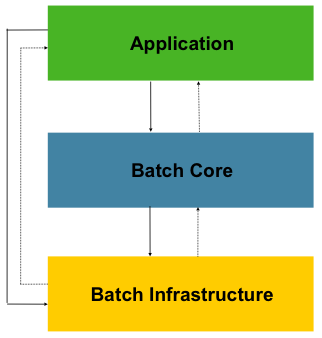

# 1. Spring Batch Introduction
엔터프라이즈 도메인 내의 많은 애플리케이션은 미션-크리티컬 환경에서 비즈니스 운영을 수행하기 위해 대량(bulk) 처리가 필요하다. 이러한 비즈니스 운영에는 다음이 포함된다:

- 사용자 개입 없이 가장 효율적으로 처리되는 대량 정보의, 자동화되고 복잡한 처리. 이러한 작업에는 일반적으로 시간-기반 이벤트(월말 계산, 통지 또는 통신 등)가 포함된다.
- 매우 큰 데이터 세트(예: 보험 혜택 결정 또는 요율 조정)에서 반복적으로 처리되는 복잡한 비즈니스 규칙의 주기적 적용.
- 트랜잭션 방식으로 일반적인 포매팅(formatting), 유효성 검사 및 처리가 필요한 내부 및 외부 시스템에서 수신한 정보를 기록 시스템에 통합. 배치 프로세스(Batch processing)는 기업에서 매일 수십억 건의 트랜잭션을 처리하는 데 사용된다.

스프링 배치는 엔터프라이즈 시스템의 일상적인 운영에 필수적인 강력한 배치 애플리케이션을 개발할 수 있도록 설계된 가볍고, 포괄적인 배치 프레임워크이다. 스프링 배치는 사람들이 기대하는 스프링 프레임워크의 특성(생산성, POJO 기반 개발 접근 방식 및 일반적인 사용 편의성)을 기반으로 하며, 개발자가 필요할 때 고급 엔터프라이즈 서비스에 쉽게 접근하고 사용할 수 있도록 한다. 스프링 배치는 스케줄링 프레임워크가 아니다.상용 및 오픈 소스 영역 모두에서 사용할 수 있는 우수한 엔터프라이즈 스케줄러가 많이 있다. 예를들어 쿼츠(Quartz), 티볼리(Tivoli), 컨트롤엠(Control-M) 등. 스프링 배치는 스케줄러를 대체하는 것이 아니라 스케줄러와 함께 작동하도록 설계되었다. 

스프링 배치는 로깅 및 추적, 트랜잭션 관리, 작업 처리 통계, 작업 재시작, 건너뛰기, 리소스 관리 등 대용량 레코드 처리에 필요한 필수 기능들을 재사용 가능하도록 제공한다. 또한 최적화 및 파티셔닝 기술을 통해 대량 및 고성능 배치 작업을 가능하게 하는 고급 기술 서비스 및 기능을 제공한다. 간단한 사용 사례(예: 데이터베이스로 파일 읽기 또는 저장 프로시저 실행)와 복잡한, 대량 사용 사례(예: 데이터베이스 간에 대량 데이터 이동, 변환 등) 모두에서 스프링 배치를 사용할 수 있다. 대량 배치 작업은 확장성이 뛰어난 방식으로 프레임워크를 사용하여 대량의 정보를 처리할 수 있다.

## 1.1. Background
오픈 소스 소프트웨어 프로젝트 및 관련 커뮤니티에서 웹 기반 및 마이크로서비스 기반 아키텍처 프레임워크에 더 많은 관심을 기울이는 동안, 자바-기반 배치 프로세스에 대한 엔터프라이즈 IT 환경의 요구 사항을 수용하기 위해 재사용 가능한 아키텍처 프레임워크에 대한 집중도가 눈에 띄게 부족했다. 재사용 가능한 표준 배치 아키텍처의 부족은, 클라이언트 엔터프라이즈 IT 내에서 개발된 많은 일회성 사내 솔루션을 확산시켰다. 

SpringSource(현재 VMware)와 Accenture가 협력하여 이를 바꿨다. 배치 아키텍처 구현에 대한 Accenture의 실무 및 기술 경험, SpringSource의 깊이 있는 기술 경험 및 스프링의 입증된 프로그래밍 모델이 함께 자연스럽고 강력한 파트너십을 형성하여 엔터프라이즈 자바의 중요한 격차를 메우는 것을 목표로 하는 시장 관련 고품질 소프트웨어를 만들었다. 두 회사는 스프링 기반의 배치 아키텍처 솔루션을 개발하여 유사한 문제를 해결하는 여러 고객과 협력했다. 이 협력은 클라이언트가 제기한 실제-문제에 솔루션을 적용할 수 있도록 도움이 되는 몇 가지 유용한 추가 세부 정보와 실제-제약 조건을 제공했다.

Accenture는 지원, 개선 및 기존 기능 세트를 구동하기 위한 커미터 리소스와 독점 배치 처리 아키텍처 프레임워크를 스프링 배치 프로젝트에 기여했다. Accenture의 기여는 몇 세대 동안의 플랫폼들과 배치 아키텍처를 구축한 수십 년간의 경험을 기반으로 한다. 메인프레임의 코볼, 유닉스의 C++, 이제 어디서나 볼 수 있는 자바.

Accenture와 SpringSource의 공동 작업은 소프트웨어 처리 접근 방식, 프레임워크 및 엔터프라이즈 사용자가 배치 애플리케이션을 생성할 때 일관되게 사용할 수 있는 도구의 표준화를 촉진하는 것을 목표로 한다. 기업 IT 환경에 검증된 표준 솔루션을 제공하고자 하는 기업 및 정부 기관은 스프링 배치의 이점을 누릴 수 있다.

## 1.2. Usage Scenarios
일반적인 배치 프로그램:
- 데이터베이스, 파일 또는 대기열(queue)에서 많은 수의 레코드를 읽는다. 
- 특정 방식으로 데이터를 처리한다.
- 수정된 형태로 데이터를 다시 쓴다.
스프링 배치는 이 기본 배치 반복을 자동화하여, 사용자 상호 작용 없이 오프라인 환경에서 유사한 트랜잭션 세트로 처리하는 기능을 제공한다. 배치 작업은 대부분의 IT 프로젝트의 일부이며, 스프링 부트는 강력한 엔터프라이즈급 솔루션을 제공하는, 유일한 오픈 소스 프레임워크이다.

### 1.2.1. Business Scenarios
스프링 배치는 다음 비즈니스 시나리오를 지원한다:
- 배치 프로세스를 주기적으로 커밋.
- 동시 일괄 처리: 작업의 병렬 처리.
- 단계적, 엔터프라이즈 메시지-기반 처리.
- 대규모 병렬 배치 처리
- 실패 후 수동 또는 예약된 다시 시작.
- 의존 단계의 순차적 처리(워크플로우-기반 배치의 확장)
- 부분 처리: 레코드 건너뛰기(skip)(예: 롤백)
- 전체 배치 트랜잭션, 배치 크기가 작거나 존재하는 저장 프로시저 또는 스크립트가 있는 경우

### 1.2.2. Technical Objectives
스프링 배치의 기술적 목표는 다음과 같다:
- 배치 개발자가 스프링 프로그래밍 모델을 사용하도록 허용: 비즈니스 로직에 집중하고 프레임워크가 인프라를 관리하도록 한다.
- 인프라, 배치 실행 환경, 및 배치 애플리케이션 간의 문제를 명확하게 구분한다.
- 모든 프로젝트에서 구현할 수 있는 인터페이스로 공통의 핵심(core) 실행 서비스를 제공한다.
- "즉시" 사용할 수 있는 핵심 실행 인터페이스의 간단한 기본 구현을 제공한다.
- 모든 계층에서 스프링 프레임워크를 사용하여 서비스를 쉽게 구성, 사용자 지정 및 확장할 수 있다.
- 존재하는 모든 핵심 서비스는 인프라 계층에 영향을 주지 않고 쉽게 교체하거나 확장할 수 있어야 한다.
- 메이븐을 사용하여 구축된, 애플리케이션과 완전히 분리된 아키텍처 JAR로, 간단한 배포 모델을 제공한다.

### 1.3. Spring Batch Architecture
스프링 배치는 확장성과 다양한 엔드-유저를 고려하여 설계되었다. 다음 이미지는 엔드-유저인 개발자를 위한 확장성과 사용 편의성을 지원하는 계층화된 아키텍처를 보여준다.

Figure 1. 스프링 배치의 아키텍처 계층

이 계층화된 아키텍처는 세 가지 주요 상위 구성 요소를 가지고있다: 애플리케이션(Application), 코어(Core), 그리고 인프라스트럭처(Infrastructure). 애플리케이션에는 스프링 배치를 사용하여 개발자가 작성한 모든 배치 작업 및 사용자 지정 코드가 포함되어 있다. 
배치 코어에는 배치 작업을 시작하고 제어하는 ​​데 필요한 핵심 런타임 클래스가 포함되어 있다. 여기에는 `JobLauncher`, `Job` 및 `Step`에 대한 구현이 포함된다. 배치 코어에는 배치 작업을 시작하고 제어하는 ​​데 필요한 핵심 런타임 클래스가 포함되어 있다. 인프라스트럭처에는 애플리케이션 개발자(`ItemReader` 및 `ItemWriter`와 같은 읽기 및 쓰기)가 모두 사용하는 일반 읽기 및 쓰기과 및 핵심 프레임워크 자체(자체 라이브러리인, 재시도) 서비스(예: `RetryTemplate`)가 포함되어 있다.